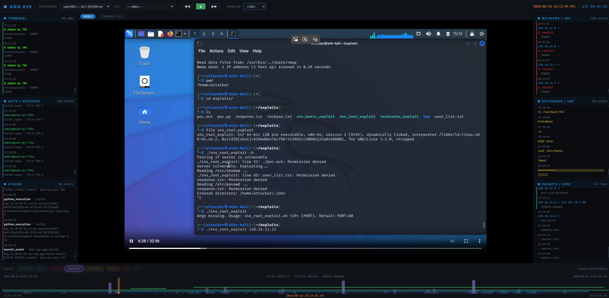

# SANN

SANN is a forensic-style viewer for cybersecurity scenarios. You give it a session — screen recording, terminal casts, syslog, auth logs, Suricata alerts, Zeek flows, sensor packets, keylogger output, behavior tracker events — and it puts everything on a single synchronized timeline. Scrub the cursor and the video, the terminal cast, and six event panels all move together.

It runs on a laptop. SQLite for storage, FastAPI for the backend, plain HTML/JS for the UI. No build step on the frontend.



---

## Contents

- [What it does](#what-it-does)
- [How it works](#how-it-works)
- [Tech stack](#tech-stack)
- [Install](#install)
- [Running it](#running-it)
- [Loading data](#loading-data)
- [Using the UI](#using-the-ui)
- [Multiple projects](#multiple-projects)
- [Dataset layout](#dataset-layout)
- [Configuration](#configuration)
- [API reference](#api-reference)
- [Security notes](#security-notes)
- [Troubleshooting](#troubleshooting)
- [Project structure](#project-structure)

---

## What it does

A red-team or CTF session typically produces a pile of artifacts: a screen recording of the attacker's workstation, asciinema casts of every terminal they opened, kernel-level syslog from each victim host, authentication logs, Suricata IDS alerts, Zeek connection logs, raw packet captures, a keylogger TSV, behavior tracker events from honeytrap, and so on. Reviewing all of that means jumping between a video player, a SIEM, and a stack of text files, then mentally lining the timestamps up.

SANN does that lining up for you. Every artifact gets parsed into a single SQLite schema, classified under the MITRE ATT&CK taxonomy, and exposed through a web UI that keeps a video, a terminal cast, and six live event panels on the same cursor.

The unit of work is a **participant session** — one user (something like `user2003`) producing one screen recording plus N casts plus arbitrary log streams. Sessions are grouped into **projects** (e.g. the `P003` or `P032` scenario sets), and each project gets its own isolated database.

---

## How it works

There are three moving pieces.

### 1. Ingest — `ingest_v2.py`

A single Python script that walks a dataset directory and turns raw files into rows in SQLite. Each supported format has its own parser:

| File | Parser | What it gives you |
|---|---|---|
| `*.cast` | `parse_cast_file` | Terminal output + extracted commands + cwd from prompts |
| `recording.{ogv,webm}` | `parse_video_file` (metadata only) | Start time, duration |
| `auth.log` | `parse_auth_log` | SSH / sudo / PAM events |
| `syslog` | `parse_syslog` | Kernel and systemd events |
| `eve.json` | `parse_suricata_eve` | IDS alerts, HTTP, DNS, flows |
| `conn.log` | `parse_zeek_conn` | TCP/UDP connection records |
| `bt.jsonl` | `parse_bt_jsonl` | Honeytrap behavior events |
| `sensor*.log` | `parse_sensor_log` | Raw `sensor_packet` records |
| `UAT-*.tsv` | `parse_uat_log` | Keylogger / typed text |
| `hacktools.log` | `parse_hacktools` | Tool invocations |
| `apt.log` | `parse_apt_log` | Repo activity |

All events land in the same `events` table — 35 columns covering timestamp, source, host, user, command, src/dst IP and port, action category, MITRE tactic/technique, alert info, HTTP fields, etc. Anything the parser can't fit into a column gets dumped into `raw_data` as JSON so you can recover it later.

A few details that took some iteration to get right:

- **Suricata timezones.** Suricata writes ISO timestamps with an explicit offset (`2025-08-15T11:25:23.826914-0400`). The parser normalizes the compact offset, parses with the offset preserved, converts to UTC, then stores naive UTC. Earlier versions stripped the offset and stored local time, which made suricata events appear several hours before the video window for any EDT host.
- **`sensor_packet` lines.** These look like JSON but use single quotes (`{'time': ..., 'data': {...}}`). They are Python dict literals, not JSON. The parser tries `ast.literal_eval` first and falls back to a JSON-with-quote-swap heuristic. Using only the swap heuristic corrupts payloads containing apostrophes.
- **Syslog years.** The classic syslog format (`Aug 15 19:07:17 host kernel: ...`) has no year. The ingester guesses from file mtime, and a post-processing pass cross-checks against the cast header epoch (which carries the real year) and shifts the rows if the guess was wrong.
- **C2 attribution.** `sensor_packet` events whose src or dst IP matches the project's configured attacker IPs get reclassified as `command_and_control`. The attacker IP set is project-scoped.

MITRE classification uses two stages. First, a dict lookup on `action_name` handles the cases the source itself labels (e.g. `sudo_execution` → `privilege_escalation`). Then a list of `(regex, phase, tactic, technique)` rules runs against the command text — `nmap` → `reconnaissance`, `crontab` → `persistence`, `sudo` → `privilege_escalation`, and so on. First match wins. Anything that doesn't match falls to `unknown`.

When the ingester is invoked with `--main-db` and `--project-id`, it dual-writes every event: once into the project's own database, once into the combined corpus with `project_id` stamped on the row. That means you can query a single project in isolation, or run cross-project queries against the corpus, without picking up front.

### 2. Post-processing — `import_manager.py`

Runs after ingest and fixes things in place. All steps are idempotent — safe to re-run with `--skip-ingest`.

- `dedupe_orig_participants` — drops events and media rows from `*.orig` participant folders, which are re-runs of the same session.
- `fix_recon_taxonomy` — rewrites the legacy `recon` label to `reconnaissance` (MITRE TA0043).
- `fix_suricata_timestamps` — for each participant, detects the offset from the first `eve.json` and SQL-updates all stored suricata timestamps. This catches DBs ingested before the parser fix.
- `rebuild_media_registry` — clears and rebuilds the table of video / cast files by scanning disk. Cast duration comes from the last frame's offset; video duration from `ffprobe`.
- `fix_syslog_years` — same idea as fixing suricata, but for the inferred-year problem in syslog/auth.
- `validate` — for each participant with a video, checks that at least 2 of the 6 panels have events inside the video window, and that the first terminal event lands within 60s of video start.

There's also a `run_full_pipeline()` function that wraps the whole chain plus the ingest step. The API uses this when you upload a ZIP.

### 3. API + frontend — `api/main.py`, `frontend/palantir.html`

The API is FastAPI, around 40 endpoints. Two helpers route every query:

- `q(sql, params)` always hits the main corpus DB.
- `qp(project_id, sql, params)` routes to the project DB when `project_id` is given and exists, or to the main DB when it's empty. If you pass a project ID that doesn't exist, you get a 404 — earlier versions silently fell back to the main DB, which made typos return the wrong data without anyone noticing.

The frontend is a single HTML file. No bundler, no framework, no node_modules. State lives in one `S` object, rendering is direct DOM. The asciinema player is loaded from a CDN. Everything else is hand-rolled.

The synchronization model is straightforward: there's a master cursor (`S.cursorEpoch`, a Unix epoch float). A 250ms tick reads `currentTime` from whichever medium is playing and updates the cursor. When you scrub manually, the cursor updates first and a sync function seeks the active medium. Switching between VIDEO and TERMINAL CAST runs the same sync function on whichever you just made active. Panels refetch when the cursor moves more than 5 seconds since the last fetch.

OGV/Theora video doesn't seek natively in Chrome (Chrome dropped Theora support), so seeking is implemented by restarting ffmpeg with `-ss <offset>` and reloading the `<video>` source. You see a "TRANSCODING…" overlay while it spins up; if ffmpeg never produces output (missing binary, bad file), a 30s timeout shows a toast and gives up instead of hanging forever.

---

## Tech stack

- Python 3.11+
- FastAPI + uvicorn
- SQLite
- ffmpeg / ffprobe (system binaries)
- Vanilla HTML / CSS / JS (asciinema-player loaded from CDN)

Pinned Python deps in `requirements.txt`. No JS package manager.

---

## Install

```bash
git clone https://github.com/vidzza/SANN.git
cd SANN
pip install -r requirements.txt
sudo apt install ffmpeg
```

On macOS:

```bash
brew install ffmpeg
```

On Windows / WSL, the same `apt install` works inside WSL. Native Windows installs would need an ffmpeg binary on PATH.

Copy the env template:

```bash
cp .env.example .env
```

You can leave the defaults if you plan to upload data through the UI. If you have a dataset on disk you want to ingest from a local path, edit `SANN_DATA_ROOT` to point at it.

---

## Running it

```bash
python3 -m uvicorn api.main:app --host 0.0.0.0 --port 8000
```

Open **http://localhost:8000/threat**. The UI loads against an empty database on a fresh install — every endpoint that needs the `events` table returns an empty result rather than 500'ing, so you can verify the server is up before you have any data.

To run on a different port, change `--port`. To bind only locally, use `--host 127.0.0.1`.

---

## Loading data

Three ways. Pick whichever fits your workflow.

### Option A — Import an archive through the HUD

This is the easiest path and the one I'd hand to someone testing the platform for the first time.

1. Pack your dataset folder into a `.zip`, `.tar`, `.tar.gz` (or `.tgz` / `.tar.bz2`). The archive root should contain one or more `user<id>/...` subdirectories matching the [Dataset layout](#dataset-layout) section below.
2. Open **http://localhost:8000/threat** and click **⊕ IMPORT** in the top bar.
3. Fill in the project name (e.g. `P032`), optionally the attacker IPs (comma-separated), pick the archive, hit **Import**.
4. The dialog polls every 3s. The status line walks through `Uploading…` → `Ingesting… <N> events so far` → `Done — <N> events`. Time depends on size; a typical session takes 30 seconds to a few minutes.
5. The new project appears in the **PROJECT** dropdown and you can start scrubbing.

Behind the scenes the API extracts the archive into `data/uploads/dataset_<id>/`, runs `import_manager.py` against it in a background thread (full pipeline — ingest plus all the post-processing steps), then triggers a media sync so the video and casts show up in the registry. If anything fails the project gets marked `error` instead of `ready`.

### Option B — Create a project from a path on disk (dashboard UI)

If your dataset is already extracted somewhere on disk (or it's a big archive you don't want to re-upload), use the dashboard:

1. Open **http://localhost:8000/** (the dashboard, not `/threat`).
2. In the **Create Project** card, choose **dataset**, fill in the project name, and paste the absolute path into **Data directory path**. The path can point at either:
   - a directory laid out like the [Dataset layout](#dataset-layout) section below, **or**
   - a `.zip` / `.tar` / `.tar.gz` archive — the server extracts it into `data/uploads/dataset_<id>/` for you.
3. Click **Create**, then hit **Ingest** on the new project card to run the pipeline.

The path you paste must resolve under one of the allowed roots (configurable via `SANN_ALLOWED_DATA_ROOTS`, defaults to `SANN_DATA_ROOT`'s parent, `$HOME`, `/mnt`, `/tmp`, and `data/uploads/`). WSL-style paths copied from Windows Explorer (`\\wsl.localhost\<distro>\...` or `C:\...`) are translated automatically.

### Option C — Ingest from the CLI

Faster for large datasets in scripted workflows.

```bash
# Edit .env so SANN_DATA_ROOT points at your dataset
python3 import_manager.py
```

This processes the default dataset and writes to `data/sann.db`.

For an isolated project (same as what the dashboard does internally):

```bash
python3 import_manager.py \
  --data-root /path/to/P032 \
  --db data/project_9c4cee20.db \
  --project-id 9c4cee20 \
  --main-db data/sann.db \
  --attacker-ips "128.16.11.9,114.0.194.2"
```

If you've already ingested and just want to re-apply the post-processing passes (after editing classifier rules, for example):

```bash
python3 import_manager.py --skip-ingest
```

---

## Using the UI

The HUD has four areas.

**Top bar.** PROJECT picks the dataset, PARTICIPANT picks the user inside that dataset, ⊕ ZIP opens the upload modal, and the row of pills on the right is the MITRE ribbon — 14 tactics plus `unknown`. The currently dominant tactic at the cursor lights up.

**Media zone.** Switchable between VIDEO (the screen recording) and TERMINAL CAST (asciinema replay). Both stay in sync — scrub one and the other follows. The VIDEO pane streams the OGV file transcoded to WebM on demand; the TERMINAL CAST pane uses the asciinema-player loaded from CDN.

**Master scrubber.** A heatmap of event density across the full session, colored by the dominant MITRE tactic per bucket. Drag the cursor anywhere to jump there. The dark vertical bars under the heatmap show where the video and casts cover the timeline.

**Six event panels.** Each panel shows events from a window of ±120s around the cursor.

| Panel | Sources |
|---|---|
| TERMINAL | `terminal_recording` |
| AUTH | `auth` |
| SYSLOG | `syslog` |
| NETWORK | `suricata`, `bt_jsonl` |
| KEYLOGGER | `uat` |
| PCAP | `zeek`, `sensor` |

Panels show `X of Y (last 200)` when more than 200 events are in the window, so you know there's more to see. Your scroll position is preserved during refetches, so reading the top of a panel doesn't kick you to the bottom every time the cursor advances.

The PCAP panel filters `sensor_packet` rows that have no IPs and no meaningful action — those are L2 noise that would otherwise drown the panel.

Errors (failed fetches, missing ffmpeg, etc.) appear as a toast in the bottom-right corner. They don't break the UI.

---

## Multiple projects

Every project has its own SQLite at `data/project_<id>.db`. Switching projects in the dropdown tears down the current state — pauses the video, disposes the cast player, clears the panels, resets the cursor — and reloads everything from the new project.

Every event also gets written into the main corpus `data/sann.db` with `project_id` stamped. That means:

- Queries scoped to a project (`?project_id=da2c86c9`) hit the project DB directly.
- Queries without a `project_id` hit the corpus and see all projects combined.
- Cross-project analysis is one SQL query.
- Sharing a single project's data with someone means handing them one `.db` file.

Creating a project from a folder path via API:

```bash
curl -X POST http://localhost:8000/api/projects \
  -H "Content-Type: application/json" \
  -d '{
    "name": "P032",
    "project_type": "dataset",
    "data_path": "/path/to/P032",
    "attacker_ips": "128.16.11.9,114.0.194.2"
  }'

# then kick off ingest
curl -X POST http://localhost:8000/api/projects/<project_id>/ingest
```

Deleting a project (`DELETE /api/projects/<id>`) removes the project row, all events for that project in the main corpus, all media registry rows for that project, and the standalone project DB file.

---

## Dataset layout

The ingester scans for files anywhere under `user<id>/`, so the layout in between is flexible. What it looks for:

```
dataset/
└── user<id>/
    └── <scenario>/<run>/<host>/
        ├── *.cast              # asciinema terminal recording
        ├── UAT-*.tsv           # keylogger / typed-text
        ├── auth.log            # SSH / sudo / PAM
        ├── syslog              # systemd / kernel
        ├── eve.json            # Suricata events
        ├── bt.jsonl            # honeytrap behavior
        ├── conn.log            # Zeek connections (JSONL)
        ├── sensor*.log         # raw sensor_packet
        ├── recording.ogv       # screen recording (or .webm)
        ├── *.pcap              # raw capture (metadata only)
        ├── hacktools.log
        └── apt.log
```

Nothing is mandatory. Missing files just leave their panel empty. The validation pass logs which panels have data for each participant.

The directory immediately under `user<id>/` becomes the `scenario_name` — common names are `training`, `ckc1`, `ckc2`, `ckc2c` (kill-chain stages), but anything works.

---

## Configuration

`.env` (loaded by the API, the ingester, and `import_manager.py`):

| Variable | Default | Purpose |
|---|---|---|
| `SANN_DATA_ROOT` | `/tmp/obsidian_full/P003` | Root of the default dataset on disk |
| `SANN_DB_PATH` | `data/sann.db` | Main corpus SQLite path |
| `SANN_ATTACKER_IPS` | (P003 defaults) | Comma-separated attacker IPs for C2 classification |
| `SANN_CORS_ORIGINS` | `localhost:8000,127.0.0.1:8000,localhost:3000` | CORS allowlist |
| `SANN_ALLOWED_DATA_ROOTS` | (auto: `SANN_DATA_ROOT` parent, `$HOME`, `/mnt`, `/tmp`, `data/uploads`) | Extra root paths under which dashboard-supplied `data_path` values are accepted |

---

## API reference

Everything accepts `?project_id=<id>` to scope to a single project. Without it, you query the combined corpus.

**Health and projects**

| Method | Path |
|---|---|
| GET | `/api/health` |
| GET | `/api/projects` |
| POST | `/api/projects` |
| POST | `/api/projects/upload` |
| GET | `/api/projects/{id}/status` |
| POST | `/api/projects/{id}/ingest` |
| POST | `/api/projects/{id}/sync_media` |
| DELETE | `/api/projects/{id}` |
| GET | `/api/projects/{id}/tree` |
| GET | `/api/projects/{id}/export/sqlite` |

**Events and stats**

| Method | Path |
|---|---|
| GET | `/api/participants` |
| GET | `/api/participants/{pid}` |
| GET | `/api/participants/{pid}/phases` |
| GET | `/api/participants/{pid}/commands` |
| GET | `/api/participants/{pid}/timeline` |
| GET | `/api/phases` |
| GET | `/api/phases/{phase}` |
| GET | `/api/timeline` |
| GET | `/api/alerts` |
| GET | `/api/network` |
| GET | `/api/commands` |
| GET | `/api/commands/top` |
| GET | `/api/users` |
| GET | `/api/hosts` |
| GET | `/api/relationships` |
| GET | `/api/behavior/{pid}` |
| GET | `/api/search?q=<term>` |
| GET | `/api/events/stream` |
| GET | `/api/events/{event_id}` |
| GET | `/api/stats` |
| GET | `/api/stats/participant` |
| GET | `/api/analysis/overview` |

**Media and timeline**

| Method | Path |
|---|---|
| GET | `/api/media` |
| GET | `/api/media/list` |
| GET | `/api/media/cast_list` |
| GET | `/api/media/cast_raw/{media_id}` |
| GET | `/api/media/cast/{media_id}` |
| GET | `/api/media/video/{participant_id}?t=<seek>` |
| GET | `/api/media/keylogger` |
| GET | `/api/timeline/sync` |
| GET | `/api/timeline/playback` |
| GET | `/api/timeline/events` |
| GET | `/api/timeline/cast/{media_id}` |
| GET | `/api/timeline/uat/{media_id}` |
| GET | `/api/timeline/pcap/{media_id}` |

---

## Security notes

The server is meant for `localhost` use. Even so:

- CORS is restricted to the allowlist in `SANN_CORS_ORIGINS`. There is no wildcard.
- Project creation validates that `data_path` resolves under the configured data root, so an API consumer can't ask the ingester to read `/etc/passwd`.
- `attacker_ips` is regex-checked before it hits the subprocess argv, so shell-injection attempts get rejected with 400.
- Every `limit` parameter is clamped at 10000.
- Filesystem paths are stripped from API responses; only filenames and stable media IDs are exposed.
- Invalid `project_id` returns 404 instead of silently falling back to the main corpus.
- Project deletion validates the project DB path resolves under `data/` before unlinking, so a tampered `db_path` field can't delete arbitrary files.
- Subprocesses use `sys.executable` instead of a hardcoded `python3`, so the active venv is honored.

If you need remote access, tunnel over SSH. Don't expose the port directly.

---

## Troubleshooting

**The video pane shows "TRANSCODING…" forever.**
ffmpeg isn't installed or isn't on PATH. Install it (`sudo apt install ffmpeg`) and reload. After 30 seconds without a frame, the overlay times out and shows an error toast.

**A panel is empty when I expect data.**
Make sure the cursor is inside the video window. Panels filter to ±120s of the cursor. The `import_manager.py` validation pass logs the panel-coverage matrix for every participant — rerun with `--skip-ingest` to see it again.

**Suricata events look hours off.**
DB ingested before the timezone fix. Run `python3 import_manager.py --skip-ingest` to rewrite the stored timestamps. The detection works off the offset in the raw eve.json.

**ZIP uploaded but no media shows up.**
Project status is `ready` but the media registry is empty. Hit `POST /api/projects/{id}/sync_media` manually. The upload flow does this automatically; if it fails, the project still gets marked ready since the events are there.

**CORS errors in the browser console.**
Add your origin to `SANN_CORS_ORIGINS` in `.env` and restart.

**`HTTP 404` from `/api/participants?project_id=...`.**
The project ID doesn't exist. List with `GET /api/projects`. The 404 is intentional — a typo doesn't silently leak combined-corpus data.

**Ingest seems to do nothing.**
The API runs ingest as a subprocess with stdout/stderr suppressed. For debugging, run the same `import_manager.py` command from the CLI to see the logs.

---

## Project structure

```
SANN/
├── api/
│   └── main.py            # FastAPI server
├── frontend/
│   ├── palantir.html      # main HUD (served at /threat)
│   ├── index.html
│   └── timeline.html
├── data/                  # SQLite DBs land here (gitignored)
├── ingest_v2.py           # parsers + MITRE classifier
├── import_manager.py      # post-processing + validation
├── requirements.txt
├── .env.example
└── README.md
```

---

Internal tool. Not for redistribution without permission.
